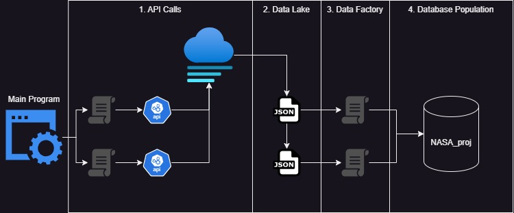

#### Updated 02/08/2024 Current version: 1.2

# NASA_DE_PROJECT: A data factoy using NASA Open API Web Services 


The NASA_DE_PROJECT takes public information provided through a network of NASA's Open APIs and populates a local database that owners can use to perform data analysis, create visualizations from, or practice data goverance/administrative exercises on.\
As this is largely a learning opportunity for the construction of Data Warehouses, historical data only spans back through 2024.  After this project is complete, historical data will be considered.

This project consists of the following components.
- Extraction (WIP)\
*used to make API calls and store raw data in Data Lake*
- Data Pipeline/Factory (WIP)\
*used to perfrom ETL process before loading to data warehouse*
- Data Warehouse (WIP)\
*stores relational tables/views in postgresql local server*
- Stored Procedures (TBD)\
*will be used to create processes for data maintainance and governance*

##### Summary

Currently, the program works in the following order:
1. Cycles through NASA Open API Web Services, updating JSON with missing data
2. Runs Data Pipeline to perform ETL processes
    - Drops views
    - Drops/Creates new tables in database
    - Inserts raw data
    - Create views

  

## Components

- `./data_factory`
    - `./data_warehouse_init`
        - `./functions`
        - `./sql_commands`
- `./data_lake_storage`
- `./extraction_scripts`
    - `./functions`
- `./logs`
- `./media`
- `.env`
- `.gitignore`
- `./main.py`
- `./readme.md`
- `./requirements.txt`

## Packages Used
- requests
- psycopg2-binary
- python-dotenv

## Release Plan
- **Version 1.1**
    - Create first draft.
    - Connect to APOD, NeoWS, DONKI APIs.
    - Create Data Pipeline/Factory for APOD, NeoWs.
- **Version 1.2**
    - Connected to EARTH, EPIC, Mars_Rover_Photos APIs.
    - Create Data Pipeline/Factory for above APIs.
- **Version 2**
    - Connect other APIS.
    - Create Data Pipeline/Factory for new APIs.
    
## Installation and Execution
*Note:*\
The user should have [python3](https://pypi.org/project/pip/) installed\
as well as have a clear understanding of [pip](https://pypi.org/project/pip/)\
and [postgresql](https://pypi.org/project/pip/).
1. **Clone Repository:**
    ```bash
    git clone https://github.com/CollinClifford/NASA_DE_PROJECT
    cd NASA_DE_PROJECT
2. **Install Dependencies:**
    ```bash
    pip install -r requirements.txt
3. **Configure Environment Variables:**
    Create a `.env` file in the project root with the necessary environment variables with the following as a template.
    ```bash
    # API Key

    API_KEY=

    # Database connections
    DB_HOST=
    DB_NAME=
    DB_USER=
    DB_PASSWORD=
    DB_PORT=
    SSL_MODE=disable
4. **Set up logs folder**\
    Create this folder path:
    ```bash
    mkdir logs
    cd logs
    touch main.log
5. **Run the Program:**\
    Execute the bash script:
    ```bash
    python3 ./main.py

please contact collinclifford@ymail.com for any inquiries about this program.